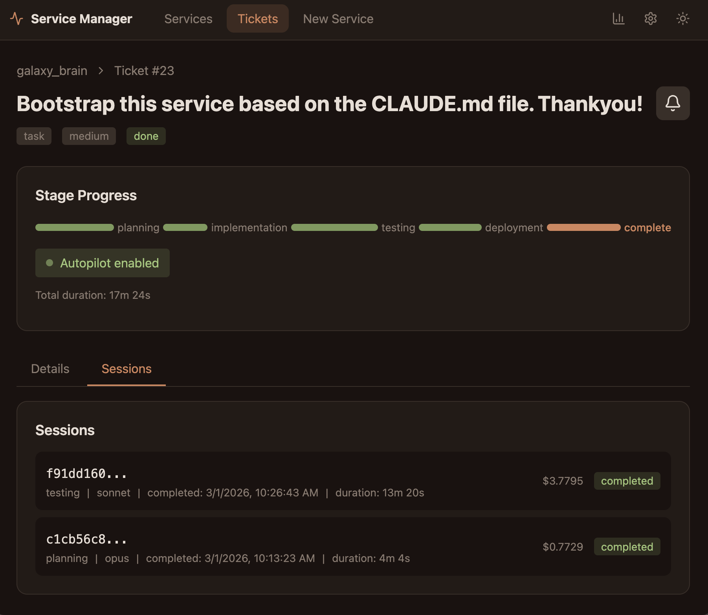
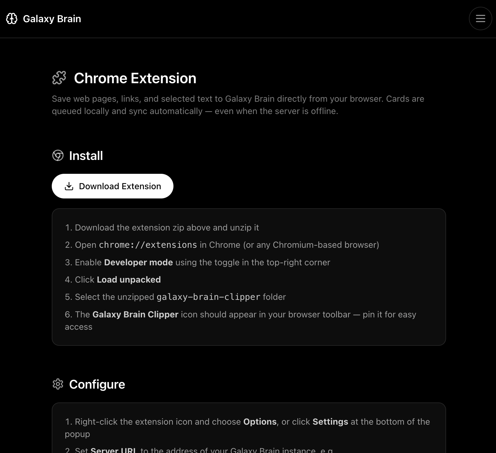
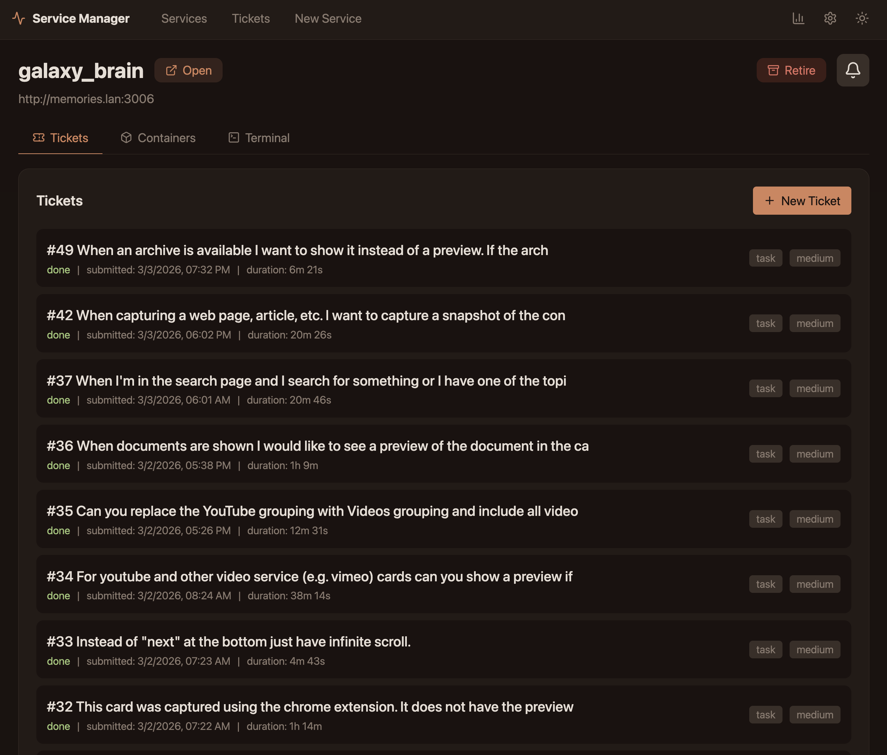

I use something called mymind for clipping things I find useful. It's nice, it
integrates into my phone, Chrome, Safari. It dumps everything into a database
with tagging. It's searchable. But it's all kind of stuck on their servers. You
can export it, but it's not very useful to me there. I want it to be more
useful. I thought it would be helpful if I documented how I could reproduce this
service by showing the process of going from the initial prompt to something
usable. 

I created a directory in my directory of services. In that directory, I created
a CLAUDE.md file with the following:

> I want to create a service like mymind for clipping information as I encounter
> it on the internet. I would like to be able to setup a secure means of
> encrypting and saving data outside my home, have it securely transferred home
> and stored there permanently. I want to be able to capture urls and archives
> of the web pages. I think using an extension in Chrome or Safari. Lets start
> on my laptop. Have it save the files locally and transfer them when done. 
> 
> I would like to have a web interface running on the server where all the files
> are stored. I should be able to create new cards here with the option of
> embedding files, if a url is supplied it should try to capture and archive the
> contents of that url. Start with something similar to mymind and I can customize it from
> there. Initialize the system with the data in mymind_export. 

The export I got from mymind was unzipped into the mymind_export sub directory.
Then I went to my service management interface, told it to rediscover services.
It found the "galaxy_brain" service, and I told it to build the service.

::: {.video-normal}

:::

*I'm using the service manager here, but you could just open Claude in that
directory and give it the same prompt to do the same thing.*

And about 18 minutes later it was done. If you look at the "Initial Service"
Video you can see what it looks like. All those things at the top? Those are
tags. Some I created but the vast majority were automatically created by mymind
when things were imported the different assets.

::: {.panel-tabset}

## Ticket Details

## Initial Service



:::

The first thing I want to do is clean this up a bit.  So I went to the service manager and submitted the following ticket:

>I don't want all of the tags to show. I want to be able to type into the search box and have it show the tags that match and allow me to auto-complete a tag. When it's auto completed, I want the tag to appear under the search box with an x to remove it. I also want to be able to type in free text in the search box to further filter things. I also want the service to create previews for known services like Blueksy or Twitter. I want to do this on import and save this information. That way it doesn't have to generate it on the fly.  

You can see me doing this in the video below. I submitted this ticket and in about 12 minutes it was done. You can see what it looks like in the "Result of First Revision" tab below:

::: {.panel-tabset}

## Ticket First Revision



## Result of First Revision



:::

For me this looks a lot better. You'll notice the main categories at the top for Article, Webpage, Xpost, etc. I didn't even notice them at first, but I think they will be useful. I'll need to clean them up a bit to suit me. I'll also probably want to make some smaller tweaks. But that can be done by adding more tickets. You can see how straight forward this is. If a ticket doesn't do what I want, I can reopen it at the bottom and prompt it with more details. Sometimes I have to do this because I wasn't specific enough at first. 

If I want a more interactive/back and forth with Claude, I can go to a terminal. I can do it on the computer (which is what I typically do if it's going to be a long discussion), or I can do it in the service manager for shorter conversations (it has a terminal embedded in each service). In this case I wanted to talk about Chrome extensions since I have no familiarity with it. I had Claude create the extension such that if I'm connected to the network it will save the card directly to the server. If I'm not connected it will save it locally on my computer and sync it later. I also had it embed a download for the extension in the app with instructions on how to use it: 

Mymind does some automatic processing when a card is added. I don't really want to replace all of that functionality, but there is some that is useful. So I went to the terminal to asked Claude to explain what it can about the process mymind goes through:

> When cards are imported they can have user notes and user defined tags. The
> current cards came mostly from my mind. It would attach other metadata upon
> import. For example it would add tags on its own. It would also apply
> a grouping (e.g. Article, Image, Document, etc.). Can you research they type of
> metadata that mymind would attach? 

It provided me with a bunch of information, I had it save it in Markdown below so you can read it:

::: {style="max-height: 500px; overflow-y: auto; border: 1px solid #ccc; padding: 1em;"}

:::  

\

From subsequent conversations, the best way to do this is to create an LLM running locally (Ollama). I don't want to embed it in this project because I want to be able to use it for other purposes. So I had Claude write up a plan for me and I'll do this part later. 

My goal here is to show how I can go from an idea to a viable service. So after going to the terminal to create the Chrome extension and better understand LLM integration. I went back to the service manager and started working on different details. You can see that here:

Finally I reached a point where I can just start using Galaxy Brain (GB) and cancel my mymind subscription. In the video below you can see how the interface now works. You can also see how I can capture a webpage using the Chrome extension. When I go back to the GB service you see the webpage archived and embedded in the card. 

::: {.video-normal}

:::